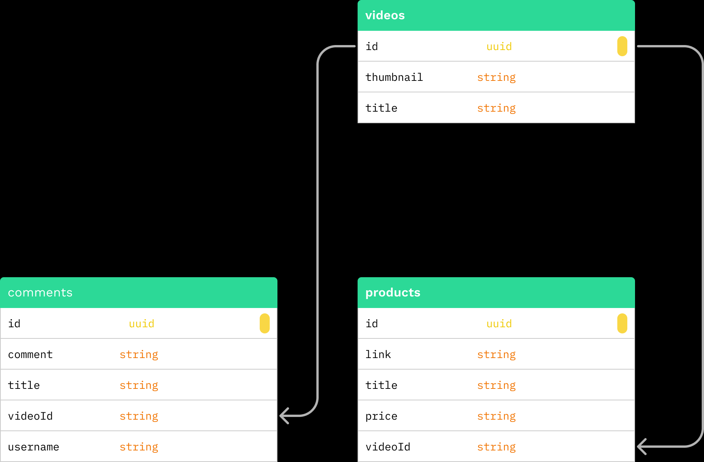

# gigih-midterm

Table of Contents

- [gigih-midterm](#gigih-midterm)
  - [Database Structure](#database-structure)
  - [API Documentation](#api-documentation)
    - [Videos](#videos)
      - [POST /videos](#post-videos)
      - [GET /videos](#get-videos)
    - [Comments](#comments)
      - [POST /comments](#post-comments)
      - [GET /comments](#get-comments)
    - [Products](#products)
      - [POST /products](#post-products)
      - [GET /products](#get-products)
  - [How to run](#how-to-run)

## Database Structure



There's 3 table in this database, whic is `videos`, `products`, and `comments`. Im not using `users` table yet, because i want to make it simple, like the requirement, where i just have to input the username directly in the comment form.

## API Documentation

### Videos

| Method | Endpoint | Description      |
| ------ | -------- | ---------------- |
| POST   | /videos  | Create new video |
| GET    | /videos  | Get all videos   |

#### POST /videos

Object
-URL Params: None
-Data Params:

    ```json
    {
    "thumbnail": "https://www.google.com",
    "title": "Test"
    }
    ```

- Headers: Content-Type: application/json
- Success Response:
  - Code: 201
  - Content:
  ```json
  {
    "id": "b3db7910-b4c5-4d84-b227-e85a2ddd0190",
    "thumbnail": "https://www.google.com",
    "title": "Test",
    "_id": "64c31f103ffa7837f557254a",
    "__v": 0
  }
  ```

#### GET /videos

Object

- URL Params: None
- Data Params: None
- Headers: Content-Type: application/json
- Success Response:
  - Code: 200
  - Content:
  ```json
  [
    {
      "_id": "64c27c31a5483241119657ac",
      "id": "cec43a0c-6694-49cf-8b7c-3a64aa8da665",
      "thumbnail": "https://www.google.com"
    }
  ]
  ```

### Comments

| Method | Endpoint  | Description        |
| ------ | --------- | ------------------ |
| POST   | /comments | Create new comment |
| GET    | /comments | Get all comments   |

#### POST /comments

Object

- URL Params: videoId=[string]
- Data Params:
  ```json
  {
    "username": "test",
    "comment": "test"
  }
  ```
- Headers: Content-Type: application/json
- Success Response:
  - Code: 201
  - Content:
  ```json
  {
    "videoId": "64c27c31a5483241119657ac",
    "comment": "Testt",
    "createdAt": "2023-07-28T01:51:36.825Z",
    "_id": "64c31f283ffa7837f557254c",
    "__v": 0
  }
  ```

#### GET /comments

- URL Params: videoId=[string]
- Data Params: None
- Headers: Content-Type: application/json
- Success Response:
  - Code: 200
  - Content:
  ```json
  [
    {
      "_id": "64c29d6ab53f6889523a217a",
      "comment": "Halo",
      "username": "Test",
      "createdAt": "2023-07-27T16:38:02.119Z"
    },
    {
      "_id": "64c29da6b53f6889523a217d",
      "comment": "Velldy Cantik",
      "username": "Velldy Cantik",
      "createdAt": "2023-07-27T16:39:02.381Z"
    }
  ]
  ```

### Products

| Method | Endpoint  | Description        |
| ------ | --------- | ------------------ |
| POST   | /products | Create new product |
| GET    | /products | Get all products   |

#### POST /products

- URL Params: videoId=[string]
- Data Params:
  ```json
  {
    "link": "test2",
    "title": "test2",
    "price": "Rp.155.000"
  }
  ```
- Headers: Content-Type: application/json
- Success Response:
  - Code: 201
  - Content:
  ```json
  {
    "id": "95da74a9-6309-416b-ab60-b9a822c01f7d",
    "link": "test2",
    "title": "test2",
    "price": "Rp.155.000",
    "videoId": "cec43a0c-6694-49cf-8b7c-3a64aa8da665",
    "_id": "64c28271685a264e5859524c",
    "__v": 0
  }
  ```

#### GET /products

- URL Params: videoId=[string]
- Data Params: None
- Headers: Content-Type: application/json
- Success Response:
  - Code: 200
  - Content:
  ```json
  [
    {
      "_id": "64c2815c79c9debcccc97afa",
      "id": "a6365de1-07da-4dfb-bae3-e552625efcdb",
      "link": "test",
      "title": "test",
      "price": "test"
    },
    {
      "_id": "64c28271685a264e5859524c",
      "id": "95da74a9-6309-416b-ab60-b9a822c01f7d",
      "link": "test2",
      "title": "test2",
      "price": "Rp.155.000"
    }
  ]
  ```

## How to run

1. Clone this repo
2. Run `npm install`
3. Change the `.env.example` to `.env` and fill the value with your own mongodb url
4. Run `npm start`
5. Open `http://localhost:3000` in your browser
6. Enjoy!

```

```
